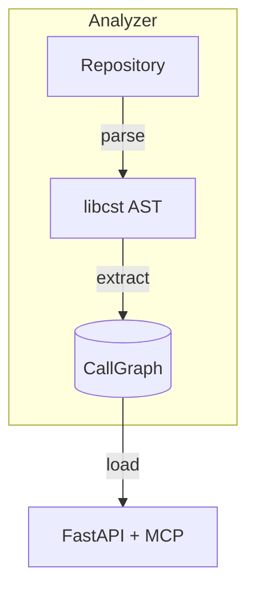

# MCP-CKG Architecture

## Domain Model
- **Repository**
- **Module**
- **Function**
- **CallEdge**

## Persistence
- Stage 1: SQLite (`src/ckg/store_sqlite.py`)
- Stage 2: PostgreSQL / Neo4j adapter

## API Layer
- FastAPI + MCP SDK
- Endpoints:
  - `GET /functions?module={name}`
  - `GET /call_edges?from={fqn}&to={fqn}`

## Flow Diagram

